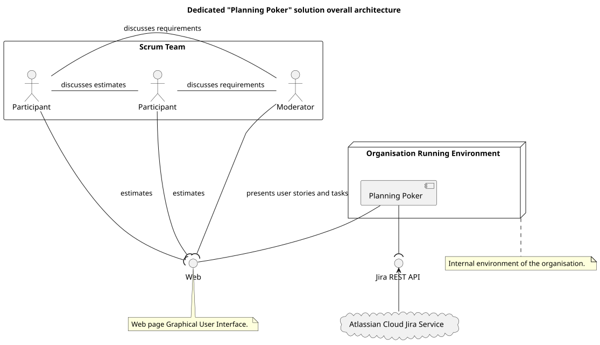
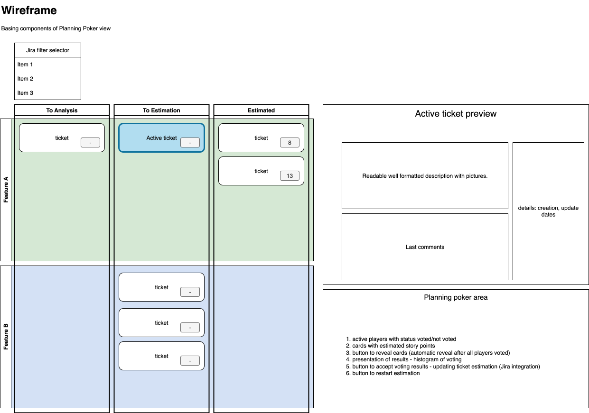

# Project Requirements

---

## Goals and outcomes

- web application implementing Planning Poker, integrated with Jira, for facilitation of tasks management in terms of
  analysis and estimation to optimize business processes in the Organisation
- evaluation of AI prototyping potential as a tool to support early project conceptual stage

## Architectural assumptions

References:

- [Jira Rest API](https://developer.atlassian.com/cloud/jira/platform/rest/v3/intro/)

## Functional requirements

Currently used
solution - [Planing Poker Agility Plugin](https://marketplace.atlassian.com/apps/1233038/planning-poker-agility-free-estimation-sizing-for-jira?hosting=cloud&tab=overview) -
is not fully satisfying the needs of the Organisation:

- poor support of Jira filters hinders estimation sessions scope
- UX requires simplification and better support of native Jira CSS
  - well formated task description with all detail, like attached images, in task view requires fixes
  - some features are redundant making view chaotic

### Refinement session view

#### Planing Poker view

- [ ] Backlog scope should be defined by selection of one of stored
      filters - [Jira, manage filters](https://support.atlassian.com/jira-software-cloud/docs/manage-filters/) - on initial
      stage of the project, selection from dropdown or text field to insert filter id
- [ ] Tasks returned by the filter should be organized in swimlanes
  - view similar to [scrum board view](https://www.atlassian.com/software/jira/features/scrum-boards)
  - estimated - if in contains story points value
  - to estimate - if story points value is missing
  - to analyze - if required more detailed specification, basing on
    specified [label](https://confluence.atlassian.com/automation112/organize-your-rules-with-labels-1688902067.html)
- [ ] Horizontally, tasks should be grouped by parent [features](https://www.atlassian.com/pl/software/jira/features)

#### Access to view

- [ ] to Join the planning poker session, user needs to know sessions URL
- [ ] few users shares the session - view need to be refreshed after any user action
- [ ] to access the view user needs to
      provide [Jira personal access token](https://confluence.atlassian.com/enterprise/using-personal-access-tokens-1026032365.html)
  - [ ] each window keeps individual context of particular user
- [ ] moderator role is distinguished
  - [ ] one session is conducted by only one moderator
  - [ ] can create session and selects the scope by providing jira filter id
  - [ ] as the only user of the session can
    - [ ] select active task,
    - [ ] move tasks between swimlanes,
    - [ ] edit description of the task in preview,
    - [ ] add comments to task in preview
  - [ ] as the only user can
    - [ ] start and finish estimation round,
    - [ ] accept and set on the task result estimation value
  - [ ] participant role is distinguished
    - [ ] participant view is automatically refreshed when
      - [ ] tasks are moved between swimlanes
      - [ ] estimation round is started/finished
    - [ ] participant can only select his own estimation value during estimation round

## Technical requirements

### AI prototyping potential evaluation

Prototyping of particular features are supported by AI agents. Generated code need to be verified and extended.

### Quality requirements

- [ ] Code is covered by unit tests with coverage above 80%
- [ ] IDE static code analysis is used to keep code quality on high level - e.g. Lint for JavaScript
  - [ ] Precommit hook is used to run static code analysis before each commit

### Code base management

- [ ] Particular features are implemented in dedicated separate feature branches
- [ ] For ready feature (or some complete stage of implementation) pull request is created to main branch
- [ ] git squash is used to keep commit history clean and readable
- [ ] Pull request has to be reviewed by product owners
- [ ] Product owners' remarks need to be fixed
- [ ] After approval, pull request is merged to main branch
